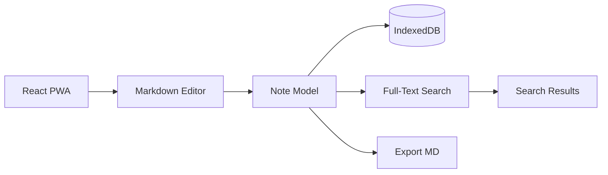
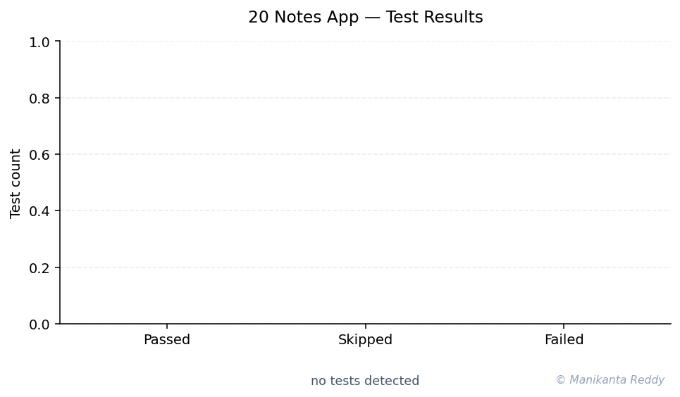

# Offline Notes - PWA Note Taking App

[](https://react.dev/)
[](https://web.dev/progressive-web-apps/)
[](https://developer.mozilla.org/en-US/docs/Web/API/IndexedDB_API)
[](LICENSE)

A production-grade, offline-first note-taking Progressive Web App (PWA) with Markdown support, full-text search, folder organization, and conflict resolution. Your notes stay on your device, always accessible even without an internet connection.

## Features

### Core Features
- **Markdown Support** - Rich text editing with live preview, syntax highlighting, and toolbar
- **Offline-First Architecture** - Works without internet using IndexedDB with localStorage fallback
- **Full-Text Search** - Powerful search with operators (tag:, folder:, phrases, exclusions)
- **Folder Organization** - Hierarchical folder structure with drag-and-drop ready design
- **Tag Management** - Add, remove, and filter by tags with autocomplete suggestions
- **Dark/Light Themes** - System-aware theme with smooth transitions
- **Responsive Design** - Optimized for mobile, tablet, and desktop

### Advanced Features
- **Conflict Resolution** - 4 strategies: last-write-wins, server-wins, local-wins, manual merge
- **Export Options** - Markdown, HTML, and Print/PDF export
- **Web Share API** - Native sharing on supported devices
- **Keyboard Shortcuts** - Full shortcut system with `?` help dialog
- **Reading Time Estimation** - Automatic word count and reading time
- **Service Worker** - Background sync and offline caching
- **PWA Installable** - Add to home screen on any device

### Note Features
- **Pin Notes** - Keep important notes at the top
- **Favorites** - Star your most-used notes
- **Auto-save** - Notes saved automatically while typing
- **Tag Filtering** - Filter notes by clicking tags
- **Search Highlighting** - Matching terms highlighted in results

## Screenshots

> **Note**: Placeholder for screenshots. After running the app, take screenshots and add them here.

```
[Desktop - Light Theme]
[Desktop - Dark Theme]
[Mobile - List View]
[Mobile - Editor View]
[Search Results]
[Folder Organization]
```

## Tech Stack

| Technology | Purpose |
|------------|---------|
| React 18 | UI framework with hooks |
| IndexedDB | Primary offline storage |
| localStorage | Storage fallback & preferences |
| Marked | Markdown parsing |
| DOMPurify | XSS prevention |
| highlight.js | Code syntax highlighting |
| Service Worker | PWA offline support |
| Web App Manifest | PWA installability |
| Jest | Unit testing |

## Quick Start

### Prerequisites
- Node.js 16+ and npm/yarn
- Modern browser (Chrome, Firefox, Safari, Edge)

### Installation

```bash
# Clone the repository
git clone https://github.com/yourusername/offline-notes-app.git
cd offline-notes-app

# Install dependencies
npm install

# Start development server
npm start
```

The app will open at `http://localhost:3000`.

### Build for Production

```bash
# Create optimized production build
npm run build

# The build/ folder contains deployable static files
```

### Run Tests

```bash
# Run all tests with coverage
npm test

# Run tests in watch mode
npm run test:watch

# Run linter
npm run lint

# Fix linting issues
npm run lint:fix
```

## Usage Examples

### Creating a Note

1. Click "New Note" button or press `Ctrl+N`
2. Enter a title and start typing in Markdown
3. Use the toolbar for formatting (bold, italic, code, links, etc.)
4. Notes auto-save as you type

### Organizing with Folders

1. Click the `+` button next to "Folders" in the sidebar
2. Enter a folder name and click Create
3. Click a folder to filter notes by it
4. New notes created while viewing a folder are added to that folder

### Using Tags

1. In the editor, click "Add Tag" and type a tag name
2. Existing tags appear as suggestions
3. Click a tag in the sidebar to filter all notes
4. Remove tags by clicking the `x` on tag chips

### Searching

```
Simple:         react components
Phrase:         "state management"
Tag filter:     tag:javascript
Folder filter:  folder:projects
Exclude:        react -hooks
Combined:       tag:react "custom hooks"
```

### Keyboard Shortcuts

| Shortcut | Action |
|----------|--------|
| `Ctrl+N` | Create new note |
| `Ctrl+S` | Save current note |
| `Ctrl+F` | Focus search |
| `Ctrl+B` | Bold text |
| `Ctrl+I` | Italic text |
| `Ctrl+K` | Insert link |
| `Ctrl+\` | Toggle sidebar |
| `?` | Show shortcuts help |
| `Escape` | Close modal / clear search |

### Exporting Notes

1. Open the note you want to export
2. Click the export icon in the toolbar
3. Choose format: Markdown, HTML, or Print/PDF
4. The file downloads automatically

## Architecture

```
offline-notes-app/
  src/
    components/        React UI components
    hooks/             Custom React hooks
    utils/             Core utility functions
    styles/            CSS with CSS variables
    index.js           App entry point + SW registration
  public/
    index.html         HTML shell with splash screen
    manifest.json      PWA manifest
    sw.js              Service worker
    icons/             App icons
  tests/               Jest unit tests
  docs/                Architecture documentation
```

See [docs/architecture.md](docs/architecture.md) for detailed architecture documentation.

### Key Design Decisions

1. **IndexedDB + localStorage Fallback** - Ensures notes persist even in restrictive browser environments
2. **Conflict Resolution Strategies** - 4 strategies for different sync scenarios
3. **Memory Caching** - Frequently accessed notes are cached for performance
4. **Component Isolation** - Each component manages its own state via hooks
5. **No External State Library** - React hooks are sufficient for this scope
6. **CSS Variables for Theming** - Single stylesheet handles both light and dark themes

## Project Structure

```
project_20_notes_app/
  src/
    components/
      App.js              - Root orchestrator component
      NoteEditor.js       - Markdown editor with toolbar + preview
      NoteList.js         - Scrollable note cards list
      NotePreview.js      - Read-only rendered preview
      Sidebar.js          - Navigation with folders/tags/stats
      SearchBar.js        - Search with suggestions
      FolderTree.js       - Hierarchical folder view
      TagManager.js       - Tag CRUD operations
      ThemeToggle.js      - Dark/light switch
      KeyboardShortcuts.js - Shortcut handler + help modal
    hooks/
      useLocalStorage.js  - localStorage state sync
      useNotes.js         - Notes CRUD + conflict resolution
      useSearch.js        - Full-text search with debounce
      useTheme.js         - Theme management
    utils/
      storage.js          - IndexedDB wrapper + fallback
      markdownParser.js   - Markdown to HTML + helpers
      searchEngine.js     - Full-text search engine
      exporters.js        - Export to MD/HTML/PDF + share
      readingTime.js      - Word count + reading time
    styles/
      app.css             - Complete app stylesheet
    index.js              - Entry point + service worker
  public/
    index.html            - HTML shell
    manifest.json         - PWA manifest
    sw.js                 - Service worker for offline
    icons/                - App icons
  tests/
    setupTests.js         - Jest test configuration
    test_storage.js       - Storage utility tests
    test_markdownParser.js - Markdown parser tests
    test_searchEngine.js  - Search engine tests
    test_readingTime.js   - Reading time utility tests
  docs/
    architecture.md       - Architecture documentation
  package.json            - Dependencies & scripts
  README.md               - This file
  LICENSE                 - MIT License
  .gitignore              - Git ignore rules
```

## Future Improvements

- **Cloud Sync** - Backend API for cross-device synchronization
- **Collaboration** - Real-time collaborative editing
- **Plugin System** - Extensible plugin architecture
- **Mobile Apps** - React Native or Capacitor wrapper
- **End-to-End Encryption** - Encrypt notes before storage
- **Full-Text WebWorker** - Background search indexing
- **Note Templates** - Predefined note templates
- **Import from Other Apps** - Import from Evernote, Notion, etc.
- **Voice Dictation** - Speech-to-text input
- **Note Linking** - Create links between notes

## Browser Support

| Browser | IndexedDB | Service Worker | PWA Install |
|---------|-----------|----------------|-------------|
| Chrome  | Yes       | Yes            | Yes         |
| Firefox | Yes       | Yes            | Yes         |
| Safari  | Yes       | Yes            | Yes         |
| Edge    | Yes       | Yes            | Yes         |

## Contributing

1. Fork the repository
2. Create a feature branch: `git checkout -b feature/my-feature`
3. Make your changes with tests
4. Run the test suite: `npm test`
5. Commit using conventional commits: `git commit -m "feat: add new feature"`
6. Push and create a Pull Request

## License

This project is licensed under the MIT License - see [LICENSE](LICENSE) file for details.

## Acknowledgments

- Icons use inline SVG for zero external dependencies
- Color scheme inspired by modern design systems
- Offline-first architecture based on service worker best practices

---

<!-- showcase:start -->

## Architecture



## Test Results



_This project is configuration-focused (Terraform / Kubernetes manifests / Docker Compose / PWA). Validation runs via the project's native tooling rather than a unit-test suite._

## References & Further Reading

- Berners-Lee, T. (2014). *Markdown — Original Spec.* [↗](https://daringfireball.net/projects/markdown/)
- W3C IndexedDB API. None [↗](https://www.w3.org/TR/IndexedDB/)

## Author

**Manikanta Reddy Mandadhi** — Senior Data Scientist (RAG / Agentic AI)

GitHub: [@Mani9006](https://github.com/Mani9006/offline-notes-app) · LinkedIn: [reddy1999](https://www.linkedin.com/in/reddy1999) · Portfolio: [manikantabio.com](https://www.manikantabio.com)

<!-- showcase:end -->
